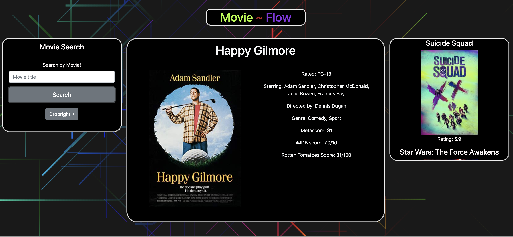

# Project 1: Movie Flow

We've made a website application that can help you search for movie information and it recommend you three movies that are of the same genre. The intial search is using an API call from OMDB and the recommendations are being given from TMDB. When the web application is looking for a recommended movie, it pulls randomly from an array of the genres of the movie you are searching for to recommend something similar.

##

## Technologies Used
1. HTML
2. CSS & Animate.CSS
3. JavaScript
4. API calls from OMDB and TMDB
5. jQuery
6. Bootstrap
7. Canvas for the background

Contributors:
1. Michael Lozing
2. Manoli Koutouzos
3. Aaron Hochman

### To add in the future:

1. Store movies that you want to see later into a watchlist.
2. Add authorization to keep your watchlist and have a profile.
3. Add an animation for when you click on a movie poster it flips over and shows you the movie info.
4. Make the website mobile ready.
5. Scrape data from Wikipedia that contains movie references of the movie you're searching and show them in a seperate div.
6. Functionality to connect the recommendations to Netflix and Hulu.
